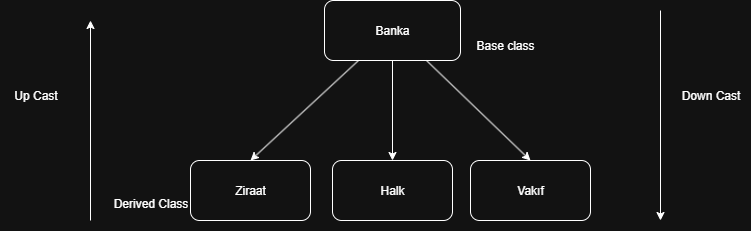

# Nesneye Yönelik Programlama


### Programlama Yaklaşımları

Prosedürel Yaklaşım

Aslında programlamaya ilk başladığımızda yaptığımız prosedürel yaklaşımdır. Program alt programlara bölünerek sırasıyla çalıştırılır.
Adım adım komut temelli yaklaşım.

```cpp
int a =10;
int b =20;
std::cout<< a+b;
```
Fonksiyonel Yaklaşım

Bir uygulamanın verilerini ve durumunu değiştirmeden her türlü işlemi fonksiyonlarla yapmasıdır.

```cpp
int a =10;
int b = 20;
std::cout<<topla(a,b);
```

Nesneye Yönelik Programlama (OOP)

Nesneye yönelik programlama, gerçek dünya varlıklarını sınıf ve nesne kavramları ile modelleyen bir yaklaşımdır. 

```cpp
class Araba {
public:
    void calistir() {
        cout << "Araba çalışıyor." << endl;
    }
};

int main() {
    Araba benimArabam;
    benimArabam.calistir();

    return 0;
}
```

Erişim Belirteçleri


| Belirteç    | Anlamı                                                     |
| ----------- | ---------------------------------------------------------- |
| `public`    | Her yerden erişilebilir.                                   |
| `private`   | Sadece sınıfın içinden erişilebilir.                       |
| `protected` | Sadece sınıfın içinden ve kalıtım yoluyla alt sınıflardan kullanılabilir. Nesne oluşturulup kullanılamaz. |


 ## Yapıcı ve Yıkıcı metodlar

**Yapıcı Metot (Constructor)**

* Sınıftan bir nesne oluşturulduğunda otomatik çalışır.

* Nesneye ilk değer atamak için kullanılır.

* İsmi, sınıf ismiyle aynıdır ve geri dönüş tipi yoktur.

* Yazmak zorunda değilsiniz,yazmazsanız derleyici otomatik olarak oluşturur.

```cpp

#include <iostream>
using namespace std;
class KrediKarti {
public:
	KrediKarti() {
		cout << "Kredi Kartı oluşturuldu";
	}
};
int main()
{
	setlocale(LC_ALL, "Turkish");

	KrediKarti ziraat;
} 
```

Burada nesne oluşturulduğunda direkt olarak KrediKarti adli metod çalışıp ekrana Kredi kartı oluşturuldu yazacak.
```cpp
#include <iostream>
using namespace std;
class KrediKarti {
public:
	KrediKarti(int a) {
		cout << "Kredi Kartı oluşturuldu";
	}
};
int main()
{
	setlocale(LC_ALL, "Turkish");

	KrediKarti ziraat(12);
}
```
 Bu şekilde parametre vererekte yapıcı metod oluşturulabilir.

```cpp
 #include <iostream>
using namespace std;
class KrediKarti {
public:
	KrediKarti(int a) {
		cout << "Kredi Kartı oluşturuldu";
	}
};
int main()
{
	setlocale(LC_ALL, "Turkish");

	KrediKarti ziraat;

}
```
Bu şekilde kod kullanımı yanlıştır. Yapıcı metod eklemek gerekiyor.

```cpp
#include <iostream>
using namespace std;
class KrediKarti {
public:
	KrediKarti(int a) {
		cout << "Kredi Kartı oluşturuldu";
	}
	KrediKarti() {

	}
};
int main()
{
	setlocale(LC_ALL, "Turkish");

	KrediKarti ziraat;
}
```
Bu seferde ekrana birşey yazmaz yapıcı metodda birşey yazmıyor.


Bir kodda birden fazla yapıcı metod olabilir. Aşırı yüklemeye benzer bir durum gibi düşünüyorum.


Yıkıcı Metot (Destructor)

* Nesne yaşamını bitirdiğinde otomatik olarak çalışır.

* Genellikle hafıza temizleme, dosya kapatma gibi işlemler için kullanılır.

* ~ işareti ile tanımlanır ve parametre almaz.
* Kendiniz çağıramazsınız.

```cpp
#include <iostream>
using namespace std;
class SanalKrediKarti {
public:
	SanalKrediKarti( ) {
		cout << "Kredi Kartı oluşturuldu"<<endl;
	}
	void KrediKarti() {
		cout << "Sanal kartla işlem yapıldı" << endl;
	}
	~SanalKrediKarti() {
		cout << "Kart Silindi";
	}
};
int main()
{
	setlocale(LC_ALL, "Turkish");

	SanalKrediKarti ziraat;
	ziraat.KrediKarti();

}
```
çıktısı:

Kredi Kartı oluşturuldu

Sanal kartla işlem yapıldı

Kart Silindi

New anahtar kelimesi kullanılmıyorsa bu stackte oluşturuluyordur.
Stackte oluşturulan nesneler de parantezler bittiği anda kaldırılır.


### Inheritance/Kalıtım/Miras

C++’ta bir sınıfın başka bir sınıfın özelliklerini ve davranışlarını miras almasını sağlar.

Ana bir sınıfınız vardır. Base class 
Bu sınıftaki özellikleri spesifik olarak alt bir sınıfta(Derived Class) kullanmak istiyorsanız bu sınıftan miras almanız gerekiyor. Böylelikle kod tekrarıda azalır. Bir nesne ürettiğiniz zaman o nesnenin sınıfı ne kadar sınıftan miras alırsa hepsinden birer nesne oluşturur. Protected ile base classta erişim verirseniz bu türetilmiş sınıflardada kullanılabilir.


```cpp


#include <iostream>
using namespace std;
class SanalKrediKarti {
public:

	SanalKrediKarti( ) {
		cout << "Kredi Kartı oluşturuldu"<<endl;
	}
	void KrediKarti() {
		cout << "Sanal kartla işlem yapıldı" << endl;
	}
	~SanalKrediKarti() {
		cout << "Kart Silindi";
	}
public:
	int sifre;
	int pukkey;
};

class ziraatsanal :public SanalKrediKarti {
	void SanalKrediKarti(){
	pukkey = 123; }

protected:
	int ziraatkod;

};
int main()
{
	setlocale(LC_ALL, "Turkish");

	SanalKrediKarti  ziraat;
	ziraat.KrediKarti();

	ziraatsanal ziraatkart;
	ziraat.sifre = 123;

}
```

ziraatsanal SanalKrediKartı classından miras almıştır.


### Pointerlarla Beraber Nesneler kullanılması


```cpp
SanalKrediKarti  ziraat;
ziraat.KrediKarti();

ziraatsanal ziraatkart;
ziraat.sifre = 123;


ziraatsanal *ziraatptr = &ziraatkart;
ziraatptr->sifre;

ziraatsanal& ziraatref=ziraatkart;
ziraatref.isim="test";
kullanılabilir.


```
Pointer kullanınca "." kullanılamıyor.

### Kalıtım ve yapıcı yıkıcı metodlar

```cpp
#include <iostream>
using namespace std;

// Üst sınıf
class Hayvan {
public:
    Hayvan() {
        cout << "Hayvan yapıcı çalıştı." << endl;
    }

    ~Hayvan() {
        cout << "Hayvan yıkıcı çalıştı." << endl;
    }

    void sesCikar() {
        cout << "Hayvan ses çıkarıyor." << endl;
    }
};

// Alt sınıf (Hayvan sınıfından türeyen)
class Kopek : public Hayvan {
public:
    Kopek() {
        cout << "Köpek yapıcı çalıştı." << endl;
    }

    ~Kopek() {
        cout << "Köpek yıkıcı çalıştı." << endl;
    }

    void havla() {
        cout << "Hav hav!" << endl;
    }
};

int main() {
    cout << "Program başladı." << endl;
    Kopek benimKopek;  // Nesne oluşturuluyor
    benimKopek.sesCikar();  // Üst sınıf metodu
    benimKopek.havla();     // Alt sınıf metodu
    cout << "Program bitiyor." << endl;
    return 0;
}
```
‼️  Yıkıcı metodlara herhangibir parametre gönderilemez.

‼️  Bir sınıftan miras alan  classtan nesne oluşturulduğu zaman hem o classtan hemde miras aldığı classtan nesne oluşturulur.

‼️ Yok edilirken önce türetilmiş sınıf yok edilir sonra ana sınıf.


### C++ REFERANS
Bir değişkenin başka bir isimle kullanılmasına izin veren bir özelliktir. Referanslar genellikle fonksiyonlara parametre olarak veri göndermek veya fonksiyonlardan veri döndürmek için kullanılır.
```cpp
int a = 10;
int& ref = a;  // ref artık a'nın başka bir adı gibi davranır
```
```cpp

#include <iostream>
using namespace std;

int main() {
    int x = 5;
    int& y = x; // y, x'in referansı

    y = 10; // x de değişir
    cout << "x: " << x << endl; // x: 10
}
```
### Fonksiyona Referans ile parametre geçirme
```cpp

void arttir(int& sayi) {
    sayi++;
}

int main() {
    int a = 7;
    arttir(a);
    cout << a << endl; // 8
}
```
int& sayi: Bu şekilde gönderilen değer kopyalanmaz, doğrudan değişkenin kendisi üzerinde işlem yapılır.

| Özellik                                   | Referans | Pointer                       |
| ----------------------------------------- | -------- | ----------------------------- |
| `NULL` olabilir mi?                       | ❌ Hayır  | ✅ Evet                        |
| Sonradan başka değişkene bağlanabilir mi? | ❌ Hayır  | ✅ Evet                        |
| Kullanımı kolay mı?                       | ✅ Evet   | ❌ Hayır  |


##	NESNELERDE CAST İŞLEMİ



Up cast işlemlerinde genelde sorun çıkmaz.

```cpp
int main(){
	ziraat ziraat;
	banka* bankaptr=&ziraat
}
```

UPCAST.

bankaptr sadece banka sınıfının erişilebilir üyelerine (public/protected) ulaşabilir.

ziraat sınıfına özgü fonksiyonlar, değişkenler vs. görünmez olur.


## ENCAPSULATION

Bir sınıfın içindeki herhangi bir nesneyi dışarıya doğrudan açmadan (veri değişken vs.) farklı yollarla erişmenin istenmesine denir.

Veriler private yapılır.
Bu verilere erişim için public fonksiyonlar (getter/setter denilir) tanımlanır.
Nesne dışarıdan değiştirilemez fonksiyonlar ile kontrol sağlanıp değiştirme yapılır.

Kapsülleme ile sağladığımız avantajları şöyle özetleyebiliriz.

* Veri koruması
* Nesne davranışı kontrolü
* Sistem çökmelerine karşı direnç


```cpp
#include <iostream>
using namespace std;

class calisan {
private:
	string ad;
	double maas;
	string departman;
public:

	void setterFunc(int maas, string departman, string ad) {
		if (maas >= 8500) {
			this->maas = maas;

		}
		else {
			cout << "Maas 8500 TL den fazla olmalıdır";
		}
		this->ad = ad;
		this->departman = departman;
	
}
	void BilgiYazdır() {
		cout << "Ad " << this->ad;
		cout << "Maas " << this->maas;
		cout << "departman" << this->departman;


	}

double getterMaas() {
		return maas;
	}


};

class Yonetici :public calisan {
private:
	double ekstraPrim;
public:

	int BilgiYazdır(int ekstraPrim) {
		double maas = getterMaas();
		return maas + ekstraPrim;
}
	void setterPrim(double prim) {
		this->ekstraPrim = prim;
	}
};


int main()
{
	calisan c1;
	c1.setterFunc( 9000, "Satın Alma","Ali");
	c1.BilgiYazdır();

	cout << "---------------------------" << endl;

	Yonetici y1;
	y1.setterFunc(12000, "BT","Zeynep");
	y1.setterPrim(3000);
	y1.BilgiYazdır(3000);


}

```
Örnek kod yapısı.

This kısmını yazarken orası aslında pointer olarak otomatik oluşturuluyor bu yüzden . yerine -> şeklinde kullanım yapıyoruz.


## Virtual Method
C++'da virtual anahtar kelimesi, bir taban (base) sınıfta tanımlanan fonksiyonun, türemiş (derived) sınıflarda yeniden tanımlanabilmesini (override edilebilmesini) sağlar.


```cpp
class Sekil {
public:
    virtual void ciz() {
        cout << "Şekil çiziliyor" << endl;
    }
};

class Daire : public Sekil {
public:
    void ciz() override {
        cout << "Daire çiziliyor" << endl;
    }
};

class Kare : public Sekil {
public:
    void ciz() override {
        cout << "Kare çiziliyor" << endl;
    }
};

int main() {
    Sekil* s1 = new Daire();
    Sekil* s2 = new Kare();

    s1->ciz(); 
    s2->ciz();  
}
```
Çıktı:

  Daire çiziliyor

  Kare çiziliyor


```cpp
#include <iostream>
using namespace std;

class Sekil {
public:
     void ciz() {
        cout << "Şekil çiziliyor" << endl;
    }
};

class Daire : public Sekil {
public:
    void ciz()  {
        cout << "Daire çiziliyor" << endl;
    }
};

class Kare : public Sekil {
public:
    void ciz()  {
        cout << "Kare çiziliyor" << endl;
    }
};

int main() {
    Sekil* s1 = new Daire();
    Sekil* s2 = new Kare();

    s1->ciz();  
    s2->ciz();  
}
```
Çıktı:

şekil çiziliyor

şekil çiziliyor


SONUÇ

Bir base sınıfın özellik ve metotlarını,  türetilen bir sınıfa aktardığımızda temel sınıfa ait metotları türemiş sınıf içerisinde de kullanabiliriz. Ancak her iki sınıfta da aynı metot bulunduğunda temel sınıftaki metot kullanılacak, türemiş sınıftaki metot ise kullanılmayacaktır.

✅virtual yoksa → temel sınıfın fonksiyonu çalışır.

✅virtual varsa → gerçek nesne tipine göre uygun fonksiyon çalışır (override yapılmışsa). 

 ## Polymorphism (Çok Biçimlilik)